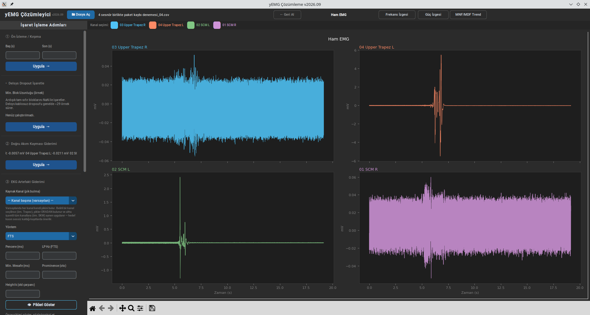
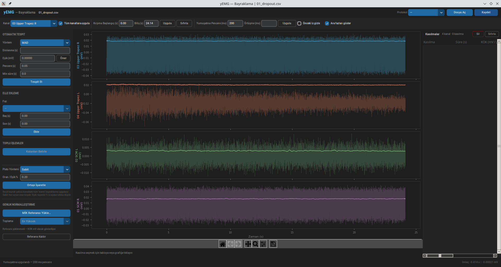

# Simple sEMG Analyzer GUI

Surface EMG (sEMG) time-domain signal processing, region flagging, and feature extraction (RMS, median/mean frequency) for bipolar single-channel recordings.

**Note:** This application is currently compatible only with data recorded using the Delsys Trigno Discover software and exported in CSV format. However, it is designed to be modular so that new file formats from other brands can be integrated.

**New to Python / never coded before?** See [docs/INSTALL.md](docs/INSTALL.md) for a full step-by-step setup guide.




## Rationale

Surface EMG can provide very useful information for researchers studying the neuromuscular system. However, the analysis of recordings made with surface EMG devices requires numerous technical steps. While the software that comes with commercial devices helps reduce this technical burden, it may not include all the processing steps recommended in the literature. Researchers with programming skills can address this shortcoming by writing their own code. However, for users who lack programming skills but are still well-versed in the musculoskeletal system and wish to conduct research in this field, suitable software with a graphical user interface (GUI) is limited.

## Aims
1. Designing a user-friendly interface for users who do not know how to code but are familiar with the musculoskeletal system and wish to perform single-channel sEMG analysis.
2. Visualizing the processed data at every step for visual verification.
3. Extending the software’s import code to work with certain open-source datasets.
4. Preparing detailed documentation.
5. Designing a GUI with Time Normalization both between and within trials and participants.

## Development Principles
- **KISS** — avoid adding unnecessary complexity
- **“Mediocre but working > perfect but not working”** — build a solid foundation first, then add features
- **Visual verification required** — no step can be a black box; every operation must be visualized
- **Transparency is a priority** — the researcher must always know what is happening
- **Terminology:** Turkish EMG terminology is being developed; the code and interface will be compatible with it
- **Built-in libraries like SciPy are preferred** — for scientific reproducibility, rather than using custom calculation code

## Technology Stack

- **Language:** Python was chosen for its capabilities in signal processing and the author’s basic knowledge of the language.
- **GUI:** CustomTkinter (a styling layer on top of Tkinter; the API is nearly identical the visual difference is significant for students, and the cost is zero)
- **Computation:** NumPy, SciPy
- **Visualization:** Matplotlib (easily embedded within CustomTkinter)
- **Data storage:** HDF5 or `.npy` (processed results), JSON (protocol files)
- **Classification/ICA:** scikit-learn (FastICA for ECG artifact removal)
- PyQt6, QWebEngineView, HTML panel — **out of scope**

## File / Module Structure

```
yemg/
├── gui.py                # Pre-processing GUI — preview/cropping, dropout
│                         # interpolation, DC offset removal, ECG artifact
│                         # removal, filtering, frequency spectrum of full
│                         # record. Steps 01–04 + 07 (skipping end frames).
│                         # gui.py CONDITIONAL — does not perform estimation/analysis.
├── flagging.py           # Analysis GUI — full-wave rectification, envelope
│                         # (Steps 05/06, also included in gui.py for educational purposes —
│                         # see Intentional Duplication), onset/offset detection,
│                         # flagging, feature extraction (KOK/RMS, MDF,
│                         # MNF), amplitude normalization (%MİK).
│                         # flagging.py PERFORMS ANALYSIS — the main analysis is here.
│                         # Three-column layout: left control panel +
│                         # graph + flagging table.
├── loader.py             # Data loading + EMGRecording dataclass — stable, mature
├── pipeline.py           # Basic steps: dc_offset, rectification, envelope,
│                         # edge_detection, normalization, rms_calculation, mnf_mdf —
│                         # stable core
├── filters.py            # Filtering: bandpass filtering + forward filter
│                         # comparison, frequency response visualization,
│                         # adaptive filters
├── ecg.py                # ECG processing: gating, template, FTS
│                         # Further development expected — ML methods, R-peak 				│					      #	enhancement
├── detection.py          # Onset/offset detection algorithms: MAD threshold,
│                         # Otsu threshold, baseline threshold, time windows.
│                         # No GUI dependency; called from flagging.py.
├── protocol.py           # Reading and validating protocol files —
│                         # `phases` schema (event_name, duration_s, type,
│                         # anchor_start, anchor_end). Since it will also use
│                         # the time normalization interface, it is a separate
│                         # independent module.
├── features.py           # Feature extraction: amplitude (KOK, mean, peak, IEMG,
│                         # %MİK), time (onset/offset/peak), frequency
│                         # (MDF/MNF/total power), fatigue index
├── utils.py              # File/folder management, saving step outputs
├── [sync.py]             # Polar H10 ↔ EMG time synchronization (planned/
│                         # draft — this file has not yet been verified)
├── [dropout.py]          # Delsys packet loss: detection, NaN marking,
│                         # interpolation (planned/draft — this file has not yet
│                         # been verified)
└── protocols/
    ├── ccfm.json
    ├── mvc_standard.json
    ├── resting_supine.json
    └── resting_standing.json
```
